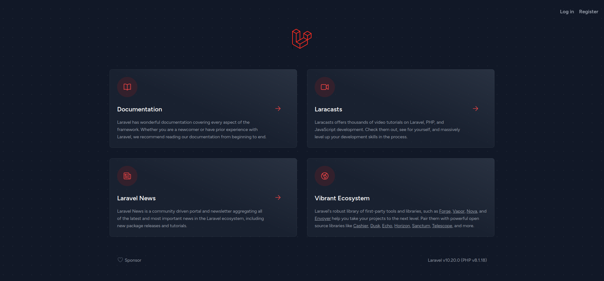

## Installation

### Requirements

In order to develop on this project please ensure that your machine fulfill the following requirements:

- [Git](https://laravel.com/docs/routing).
- [Docker](https://laravel.com/docs/container) with [docker compose plugin](https://laravel.com/docs/session).

_You must also dominate this two technologies._

This app is based on [laravel/jestream](https://jetstream.laravel.com/installation.html) application starter kit.

### Steps

- [Clone the repository](https://docs.github.com/en/repositories/creating-and-managing-repositories/cloning-a-repository)
- create a .env file <code>cp .env.example .env</code> _tune any variable as you wish_
- Boot the project with <code>docker compose up -d</code>
- Enter into the dev container with <code>docker compose exec php.dev bash</code> and execute the following lines
    - install the php dependencies <code>composer install</code>
    - generate a new app key <code>php artisan key:generate</code>
    - migrate the database <code>php artisan migrate</code>

Now enter into your [app](http://localhost) and you should see this page

## Evaluation

### Part 1: Prepare the next scenarios with end to end testings

- Register a new test account
- Login with the new test account
- Load the user profile
- Change the password
- Logout
- Login with the new password
- Update my profile name
- Check if the name was refreshed in the user actions toolbar
- Logout
- Login with an unregister account (validate the failure message)

You SHOULD modify this file providing clear instructions on how to run your tests.

> **Warning**
> All the dependencies for your testing should be declared into the docker-compose file, composer packages or node packages. The only required software in the evaluator pc will be git and docker, <b>nothing more will be installed.</b>

As end to end frameworks selections you SHOULD choose:
- [Cucumber](https://cucumber.io/)
- [Cypress](https://www.cypress.io/)
- [Selenium](https://www.selenium.dev/)

### Part 2: with the Laravel test framework (PHPUnit)
- access the index route and check if the response code is 200
- seed a test user and submit a login check all the response codes
- fake and array of 100 numbers, sort it test if the first and last elements are the same number

_this part is optional and SHOULD be resolved with the best code practices_
## License

The Laravel framework is open-sourced software licensed under the [MIT license](https://opensource.org/licenses/MIT).
